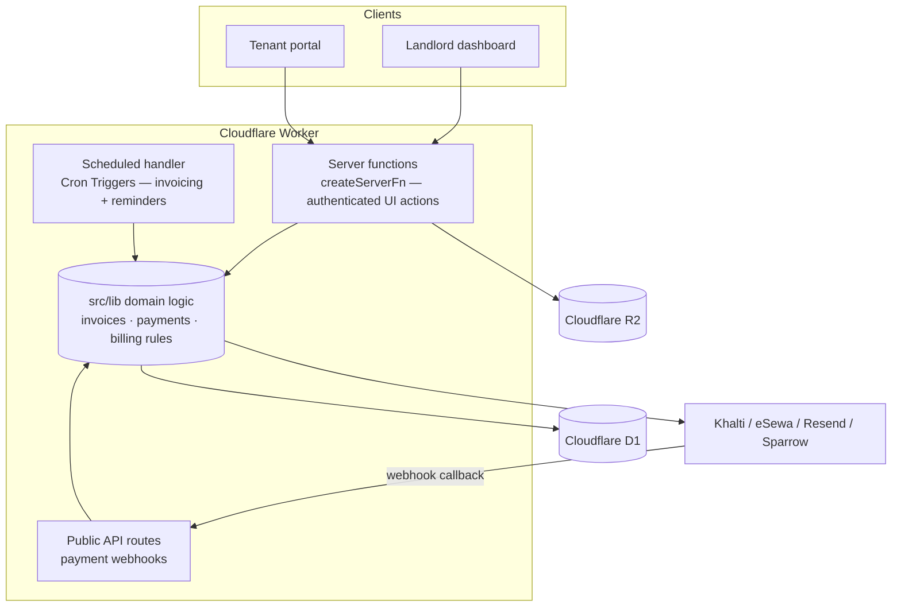
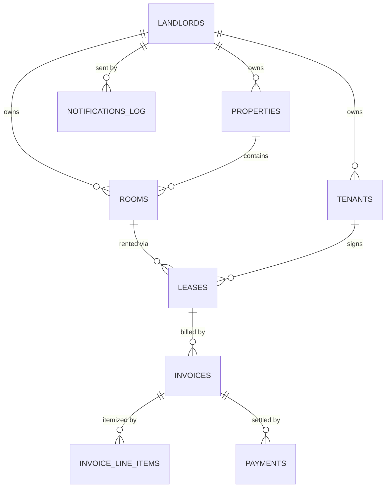

# Automated Room Rent Collection System — Build Plan

> **Audience:** This document is written to be executed by an agentic AI coding tool
> (Claude Code, Cursor agent, etc.). It is deliberately prescriptive. Decisions are
> already made — do not re-litigate stack choices. Build phase by phase, and do not
> start a phase until the previous phase's **Definition of Done** passes.

---

## 1. How an AI agent should use this document

1. Read the whole document once before writing any code.
2. Work **one phase at a time** (Section 10). Each phase is independently shippable.
3. After each phase, verify every item in its **Definition of Done** checklist.
4. Before writing TanStack Start server-function code, **verify the exact API of the
   installed version** (the input-validator method name and method-chain order have
   changed across v1 releases). Check `node_modules/@tanstack/react-start` or the
   official docs for the pinned version. Do not assume.
5. When a decision is genuinely ambiguous, stop and ask the human — do not guess on
   money handling, auth, or payment reconciliation.
6. Treat Sections 6 (invariants) and 12 (gotchas) as hard rules, not suggestions.

---

## 2. Product overview

A web application that automates monthly rent billing and collection for a landlord
renting individual rooms/units to tenants.

**Goals**
- Automatically generate a monthly invoice per occupied room.
- Send payment reminders before, on, and after the due date.
- Accept payment via Nepali wallets (Khalti, eSewa) and bank transfer.
- Give the landlord a dashboard showing who has paid and who is overdue.
- Give each tenant a portal to view invoices and pay.

**In scope (MVP)**
- A **single landlord** with multiple rooms and tenants.

**Out of scope for MVP, but the data model must not block it**
- Multiple landlords / property-management companies (multi-tenancy).
- Native mobile apps (the web app must work as an installable PWA in the meantime).
- Accounting exports, tax reports, maintenance tickets.

**Design principle:** model `landlordId` on every owned row from day one. Multi-tenancy
later becomes a query filter and an auth scope, not a rewrite.

---

## 3. Technology stack (decided — do not substitute)

| Concern | Choice | Reason |
|---|---|---|
| Framework | **TanStack Start v1 (React)** | Full-stack React, deploys cleanly to Cloudflare Workers, shares logic with a future React Native app |
| Runtime / hosting | **Cloudflare Workers** (via Nitro) + **Cloudflare Pages** for static assets | Free tier; a Cloudflare PoP inside Kathmandu gives the lowest possible latency for users in Nepal |
| Database | **Cloudflare D1** (SQLite) | Runs natively on Workers, free, no project-pausing, co-located with the Worker |
| ORM | **Drizzle ORM** (`drizzle-orm/d1`) | Type-safe, first-class D1 support, migrations via drizzle-kit |
| Auth | **Better Auth** with the D1/Drizzle adapter | Works on Workers, sessions stored in D1, no external dependency |
| File storage | **Cloudflare R2** | Free tier (10 GB); stores bank-transfer proof screenshots |
| Scheduled jobs | **Cloudflare Cron Triggers** | Built into Workers, free; runs invoicing + reminders |
| Email | **Resend** | Generous free tier; transactional invoices/receipts |
| SMS (Phase 5+) | **Sparrow SMS** (Nepal gateway) | Reliable local delivery; paid per message |
| Payments | **Khalti** + **eSewa** merchant APIs | Standard Nepali wallet checkout + server-side verification |
| Validation | **Zod** | Single source of truth for input schemas, shared client/server |
| Styling | **Tailwind CSS** | Fast, consistent; fine for a CRUD dashboard |
| Package manager | **pnpm** | — |
| Language | **TypeScript**, `strict: true` | — |

**Why not Supabase Postgres:** Cloudflare Workers cannot open arbitrary TCP
connections, so Drizzle-over-Postgres needs Hyperdrive (a paid add-on) or an HTTP
client. D1 avoids that entirely and stays free. Better Auth on D1 replaces Supabase
Auth; R2 replaces Supabase Storage.

---

## 4. System architecture

The backend has **three independent entry points**, and only one of them is a server
function. All three delegate to the same framework-agnostic domain logic in `src/lib/`.
This separation is the backbone of the design — do not collapse it.



- **Server functions** (`createServerFn`) — every action the landlord or tenant
  triggers from the UI. Authenticated, validated, scoped to the caller's `landlordId`.
- **Scheduled handler** — Cloudflare Cron fires this; it generates invoices and sends
  reminders. It is **not** a server function (cron cannot call server functions).
- **Public API routes** — payment-gateway webhooks. External services POST here, so it
  must be a plain route, not a server function. It verifies the gateway signature.
- **`src/lib/*.server.ts`** — pure domain logic, imported by all three above. This is
  the only layer allowed to mutate invoice/payment state.

### Critical rule: server functions are publicly reachable

A route-level auth guard protects the *page*, not the server function. Server
functions are reachable by direct POST regardless of which page renders them.
**Every server function that touches data must run the auth + ownership middleware.**

---

## 5. Data model

SQLite via D1. All monetary values are stored as **integers in paisa** (1 NPR = 100
paisa). Never use floats for money. All timestamps are stored as UTC ISO-8601 strings.



### Tables

**`landlords`** — one row in MVP; table exists so multi-tenancy is additive.
`id` (pk, uuid), `email` (unique), `name`, `phone`, `created_at`.

**`properties`** — model even with one property.
`id` (pk), `landlord_id` (fk), `name`, `address`, `created_at`.

**`rooms`**
`id` (pk), `landlord_id` (fk), `property_id` (fk), `name`/`number`, `floor`,
`description`, `is_active` (bool), `created_at`.

**`tenants`**
`id` (pk), `landlord_id` (fk), `name`, `email` (unique), `phone`, `notes`, `created_at`.

**`leases`** — links a tenant to a room; the source of truth for billing.
`id` (pk), `landlord_id` (fk), `room_id` (fk), `tenant_id` (fk),
`rent_amount` (int, paisa), `deposit_amount` (int, paisa),
`billing_day` (int 1–28; capped at 28 so every month has the date),
`start_date` (date), `end_date` (date, nullable),
`status` (`active` | `ended`), `created_at`.

**`invoices`**
`id` (pk), `landlord_id` (fk), `lease_id` (fk), `tenant_id` (fk),
`period` (text, `YYYY-MM`), `amount` (int, paisa — denormalized total of line items),
`due_date` (date),
`status` (`unpaid` | `partial` | `paid` | `overdue` — **derived, see Section 6**),
`created_at`, `updated_at`.
**Unique constraint: `(lease_id, period)`** — this makes invoice generation idempotent.

**`invoice_line_items`** — rent + extras (electricity, water) as separate lines.
`id` (pk), `invoice_id` (fk), `description`, `amount` (int, paisa), `kind`
(`rent` | `utility` | `adjustment`).

**`payments`** — append-only ledger. Never edited or deleted; corrections are new rows.
`id` (pk), `landlord_id` (fk), `invoice_id` (fk), `tenant_id` (fk),
`amount` (int, paisa),
`method` (`khalti` | `esewa` | `bank_transfer` | `cash`),
`status` (`initiated` | `pending_verification` | `confirmed` | `rejected` | `failed`),
`gateway_ref` (text, unique, nullable — Khalti/eSewa transaction id),
`bank_ref` (text, nullable — reference number the tenant typed),
`proof_object_key` (text, nullable — R2 key of the uploaded screenshot),
`created_at`, `confirmed_at` (nullable).

**`notifications_log`** — audit trail; also prevents duplicate sends.
`id` (pk), `landlord_id` (fk), `invoice_id` (fk, nullable), `tenant_id` (fk),
`channel` (`email` | `sms`), `kind` (`reminder_before` | `reminder_due` |
`reminder_overdue` | `receipt`), `sent_at`, `status` (`sent` | `failed`).

Plus the tables Better Auth requires (`user`, `session`, `account`, `verification`) —
created by Better Auth's schema generator.

### Recommended Indexes (for NFR-2 performance)
To guarantee that pages/dashboard resolve in < 1 second as data grows, the database must contain:
- `properties`: index on `landlord_id`
- `rooms`: index on `(landlord_id, property_id)`
- `tenants`: index on `landlord_id`, unique index on `email`
- `leases`: index on `landlord_id`, index on `tenant_id`, index on `room_id`
- `invoices`: index on `landlord_id`, index on `tenant_id`, composite unique index on `(lease_id, period)`
- `invoice_line_items`: index on `invoice_id`
- `payments`: index on `landlord_id`, index on `invoice_id`, index on `tenant_id`, unique index on `gateway_ref`
- `notifications_log`: index on `landlord_id`, index on `invoice_id`, index on `(invoice_id, kind)`

---

## 6. Domain invariants (hard rules)

These are non-negotiable. Encode them as constraints and shared functions, not as
conventions developers must remember.

1. **Money is integer paisa.** No floats anywhere. Format to NPR only at the UI edge.
2. **Invoice status is derived, never set by hand.** A single function
   `recalculateInvoiceStatus(db, invoiceId)` computes status from the sum of
   `confirmed` payments versus invoice amount:
   - `sum >= amount` → `paid`
   - `0 < sum < amount` → `partial`
   - `sum == 0` and `due_date` is in the past → `overdue`
   - otherwise → `unpaid`
   Every code path that confirms or rejects a payment must call this function.
3. **Invoice generation is idempotent.** Insert with `ON CONFLICT (lease_id, period)
   DO NOTHING`. A retried or double-fired cron must never double-bill.
4. **Payments are append-only.** A row's `status` may move forward
   (`initiated → confirmed`, `pending_verification → confirmed/rejected`) but rows are
   never deleted. Refunds/corrections are new rows.
5. **Every owned row carries `landlord_id`,** and every query filters by the
   authenticated landlord's id. This is the multi-tenancy boundary.
6. **Timezone is `Asia/Kathmandu` (UTC+05:45).** All billing-day and due-date logic
   must compute "today in Kathmandu", not server-UTC. Store UTC, reason in NPT.
7. **Webhooks are untrusted.** Verify the gateway signature/secret before acting, and
   re-verify the payment amount server-side against the invoice.
8. **A reminder is sent at most once per successfully delivered `(invoice, kind)`.** Check
   `notifications_log` for any log entry with `status = 'sent'` before sending. Failed
   dispatch logs (`status = 'failed'`) must not block subsequent retry attempts by the
   daily cron trigger.
9. **Transactional Integrity.** Multi-row operations (e.g. generating an invoice and
   its line items, or confirming a payment and recalculating the invoice status) must
   always be run inside a database transaction to prevent orphaned or inconsistent records.
10. **Webhook Idempotency.** Webhooks must check if the signature is valid and if the
    provided transaction ID (`gateway_ref`) has already been processed as `confirmed`.
    If it has, return `200 OK` immediately without repeating ledger changes.

---

## 7. Core flows

### 7.1 Monthly invoice generation (automated)
1. Cron fires daily (see Section 9).
2. Handler computes today's date in `Asia/Kathmandu`.
3. For every `active` lease whose `billing_day` == today's day-of-month, call
   `generateInvoiceForLease(lease, period)`.
4. Insert the invoice (`ON CONFLICT DO NOTHING`) plus its line items (rent + any
   recurring utilities defined on the lease).
5. Handle proration for a lease that started mid-period (MVP: optional — if skipped,
   document it and bill full month).

### 7.2 Reminders (automated)
1. Same daily cron, after invoice generation.
2. Select invoices not in `paid` status and send, guarded by `notifications_log`:
   - `reminder_before` — N days before `due_date` (N configurable, default 3).
   - `reminder_due` — on `due_date`.
   - `reminder_overdue` — M days after `due_date`, optionally recurring weekly.
3. Send via Resend (email). SMS via Sparrow is added in Phase 5.
4. Write a `notifications_log` row per send.

### 7.3 Wallet payment (Khalti / eSewa)
1. Tenant clicks "Pay" → server function `initiateWalletPayment(invoiceId, method)`.
2. Create a `payments` row, `status: initiated`, return the gateway checkout URL.
3. Tenant completes payment on the gateway.
4. Gateway calls the **public webhook route**; the route verifies the signature,
   re-checks the amount, sets the payment `confirmed`, stores `gateway_ref`, then calls
   `recalculateInvoiceStatus`.
5. As a safety net, also verify on redirect-back (do not rely on the webhook alone).

### 7.4 Bank transfer + manual verification
1. Tenant transfers money in their banking app, then in the portal submits the
   reference number and uploads a screenshot.
2. Server function `recordBankTransfer` uploads the image to R2 (using private bucket settings) and creates a
   `payments` row, `status: pending_verification`.
3. The row appears in the landlord's **verification queue**
   (`payments WHERE status = 'pending_verification'`).
4. Landlord reviews and calls `verifyPayment(paymentId, 'approve' | 'reject')`.
5. On approve → `status: confirmed`, then `recalculateInvoiceStatus`. On reject →
   `status: rejected` (tenant is notified to resubmit).
6. **Private Proof Access (Security)**: Proof screenshots stored in R2 must never be publicly accessible via R2 URLs.
   Instead, they must be proxied through an authenticated server/API endpoint (e.g. `/api/proofs/[key]`)
   which verifies the user session and user-ownership before pulling the object from R2 and streaming it.

---

## 8. Project structure

```
src/
  db/
    schema.ts            # Drizzle table definitions (Section 5)
    index.ts             # D1 -> Drizzle client factory
    migrations/          # drizzle-kit output
  lib/                   # framework-agnostic domain logic — the ONLY layer that mutates state
    money.ts             # paisa <-> NPR helpers, formatting
    dates.ts             # Asia/Kathmandu date helpers
    invoices.server.ts   # generateInvoiceForLease, recalculateInvoiceStatus
    payments.server.ts   # confirmPayment, verifyPayment logic
    reminders.server.ts  # reminder selection + dispatch
    notify.server.ts     # Resend / Sparrow wrappers
    auth.server.ts       # requireLandlord() helper
  middleware/
    auth.ts              # createMiddleware — session + landlord ownership
  server/                # server-function wrappers (thin: validate -> authorize -> call lib)
    rooms.functions.ts
    tenants.functions.ts
    leases.functions.ts
    invoices.functions.ts
    payments.functions.ts
  schemas/               # Zod schemas, shared client + server
    *.ts
  routes/
    api/
      webhooks/
        khalti.ts        # public route — gateway callback
        esewa.ts
      cron/
        run.ts           # invoked by Cron Trigger; calls lib invoicing + reminders
    _authed/             # landlord dashboard routes (auth-guarded)
    portal/              # tenant portal routes
  styles/
drizzle.config.ts
wrangler.toml            # D1 + R2 bindings, cron schedule, env vars
```

**File-suffix convention (enforce strictly):**
- `*.functions.ts` — `createServerFn` wrappers; safe to import from client code.
- `*.server.ts` — server-only logic; import only inside server-function handlers,
  cron, or webhook routes. Never import into a component.
- `*.ts` (no suffix, e.g. `schemas/`) — client-safe (types, Zod schemas, constants).

---

## 9. Scheduled jobs (Cloudflare Cron)

In `wrangler.toml`:
```toml
[triggers]
crons = ["0 1 * * *"]   # 01:00 UTC daily = 06:45 NPT
```
The Worker's `scheduled` handler (or the `/api/cron/run` route it calls) must:
1. Compute today in `Asia/Kathmandu`.
2. Run invoice generation (Section 7.1).
3. Run reminders (Section 7.2).
4. Be idempotent — safe if it runs twice in a day.

This daily cron also doubles as a keep-alive for any externally-pausing service, and
is the system's heartbeat. Log a summary row of what it did each run.

---

## 10. Build phases

Each phase ends with a **Definition of Done (DoD)**. Do not advance until every box is
checked and the app builds + deploys.

### Phase 0 — Project setup
- Scaffold TanStack Start (React) with the Cloudflare Workers target; pnpm; TS strict.
- Configure Tailwind, ESLint, Prettier.
- Create the D1 database and R2 bucket; wire bindings in `wrangler.toml`.
- Set up Drizzle + drizzle-kit; create `schema.ts` (Section 5); run the first migration.
- Install and configure Better Auth with the D1 adapter; generate its tables.
- Apply for Khalti and eSewa **merchant/sandbox accounts now** — approval takes time.
- **DoD:** `pnpm dev` runs; `pnpm build` succeeds; deploy to Workers succeeds; D1
  migration applied; a landlord can sign up and log in.

### Phase 1 — Core records + manual billing (usable MVP)
- CRUD server functions + UI for properties, rooms, tenants, leases.
- `createManualInvoice` + `recalculateInvoiceStatus` in `lib/`.
- Landlord can manually create an invoice and manually mark a cash payment.
- Landlord dashboard: list of invoices with derived status.
- **DoD:** landlord can model real rooms/tenants/leases, raise an invoice, record a
  cash payment, and see status flip to `paid`/`partial` correctly.

### Phase 2 — Automation
- `generateInvoiceForLease` + the daily Cron Trigger (Section 9).
- Reminder selection + dispatch via Resend; `notifications_log` writes + dedup.
- Tenant portal: tenant login, view their invoices.
- **DoD:** cron generates the month's invoices idempotently (verified by running it
  twice); reminder emails send once per `(invoice, kind)`; tenant can log in and see
  invoices.

### Phase 3 — Bank transfer + verification queue
- `recordBankTransfer` (uploads proof to R2), `listPendingVerifications`,
  `verifyPayment`.
- Landlord verification-queue UI: view proof, approve/reject.
- **DoD:** a tenant submits a transfer with proof; it appears in the queue; approving
  it confirms the payment and recalculates invoice status; rejecting notifies tenant.

### Phase 4 — Online wallet payments
- Khalti + eSewa: `initiateWalletPayment`, checkout redirect, public webhook routes
  with signature verification, redirect-back verification fallback.
- Email receipt on confirmed payment.
- **DoD:** a sandbox wallet payment completes end-to-end, the webhook confirms it,
  invoice status updates, and a receipt is sent. Tampered/duplicate webhooks are
  rejected.

### Phase 5 — Hardening + extras
- SMS reminders via Sparrow SMS.
- PWA manifest + service worker so the web app installs on phones, implementing cache-first strategies for static assets (JS, CSS, fonts) to ensure instant loading regardless of local connectivity (NFR-1).
- Automated D1 backup (scheduled export to R2).
- Basic reporting: monthly collected vs outstanding.
- **DoD:** app is installable as a PWA; backups run on schedule; SMS sends in
  production.

### Phase 6 — Multi-landlord readiness (future)
- Confirm every query is `landlord_id`-scoped; add scoped integration tests.
- Landlord onboarding/signup flow; optional subscription billing.
- **DoD:** two landlords' data is fully isolated, verified by tests.

---

## 11. Environment & secrets

Store via `wrangler secret` / `.dev.vars` (never commit):
`BETTER_AUTH_SECRET`, `RESEND_API_KEY`, `KHALTI_SECRET_KEY`, `KHALTI_PUBLIC_KEY`,
`ESEWA_MERCHANT_CODE`, `ESEWA_SECRET`, `SPARROW_SMS_TOKEN`,
`APP_BASE_URL`, `REMINDER_DAYS_BEFORE` (default `3`).

Bindings in `wrangler.toml`: `DB` (D1), `PROOFS` (R2 bucket).

---

## 12. Gotchas (read before coding)

- **TanStack Start API drift.** The server-function input-validator method name and the
  required method-chain order shifted across v1 releases. Confirm against the installed
  version before writing — wrong chain order is a compile error.
- **Server functions are not protected by route guards.** Auth middleware on every
  data-touching server function is mandatory (Section 4).
- **Workers can't open raw TCP sockets.** This is why D1 (not Postgres) is the database.
  Do not introduce a Node-only Postgres/MySQL client.
- **UTC+05:45.** Naive date math breaks on Nepal's 45-minute offset. Always go through
  `lib/dates.ts`.
- **Float money.** A single `parseFloat` on an amount is a bug. Integer paisa only.
- **Double billing.** Without the `(lease_id, period)` unique constraint a retried cron
  double-bills. The constraint is the safety net, not careful coding.
- **Webhook trust.** Verify gateway signature and re-check amount server-side. Never
  mark an invoice paid from unverified callback data.
- **Cron at-least-once.** Cron Triggers can fire more than once; every job must be
  idempotent.
- **D1 has no free automatic backups.** Schedule an export to R2 (Phase 5).
- **`*.server.ts` leaking to the client.** Importing server-only code into a component
  bundles secrets into client JS. Respect the file-suffix convention.
- **Tenant authentication matching**: To resolve tenant identities securely, map the Better Auth session email directly to `tenants.email`. Make `tenants.email` unique in the database to prevent duplicate entries and identity spoofing.
- **Private R2 exposure**: Never construct public URLs or expose public write/read buckets for R2 payment proof screenshots. Use a session-protected route `/api/proofs/[key]` to verify ownership before streaming files.
- **Partial/Non-transactional inserts**: Operations creating multiple connected entities (such as invoices + line items) must be wrapped in `db.transaction()` to prevent partial failure states.

---

## 13. Testing strategy

- **Unit:** `lib/` domain logic — `recalculateInvoiceStatus` across every status
  transition; money conversion; Kathmandu date helpers; proration.
- **Integration:** invoice generation idempotency (run twice → one invoice); the full
  bank-transfer verification flow; webhook signature rejection.
- **Manual/E2E per phase:** the DoD checklist for that phase.
- Use a local D1 instance (`wrangler d1` / Miniflare) for tests; never test against
  production data.

---

## 14. Suggested agentic AI workflow

- A terminal-based agent (e.g. Claude Code) or an IDE agent (e.g. Cursor) can both
  execute this plan; pick one and let it own the repo.
- Drive it **one phase at a time**. Paste the phase section, let it implement, then
  have it self-check against that phase's Definition of Done before continuing.
- Have the agent commit per phase with a clear message, so each phase is a reviewable,
  revertible checkpoint.
- Keep this file in the repo root as `plan.md` and instruct the agent to treat
  Sections 6 and 12 as invariants on every change.
- For anything touching money, auth, or payment verification, require the agent to
  show its reasoning and pause for human review before merging.
