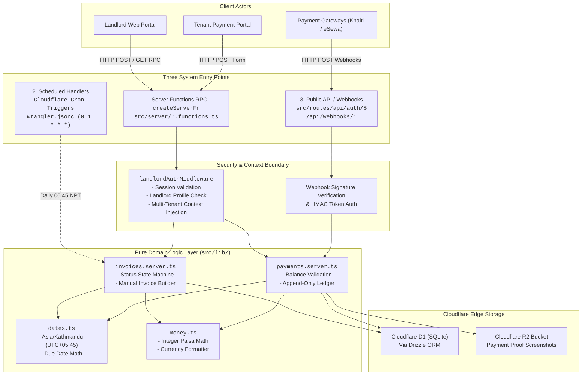
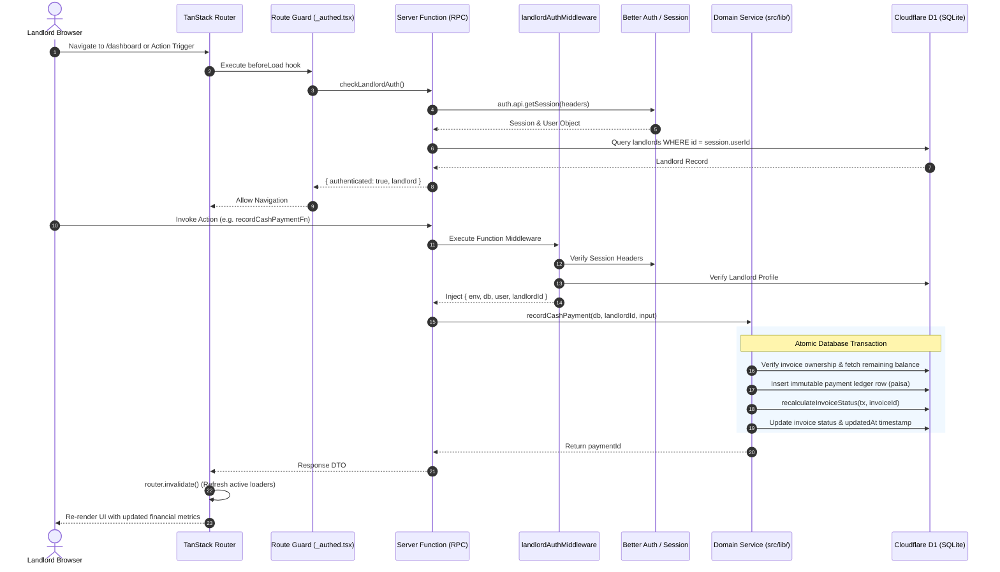
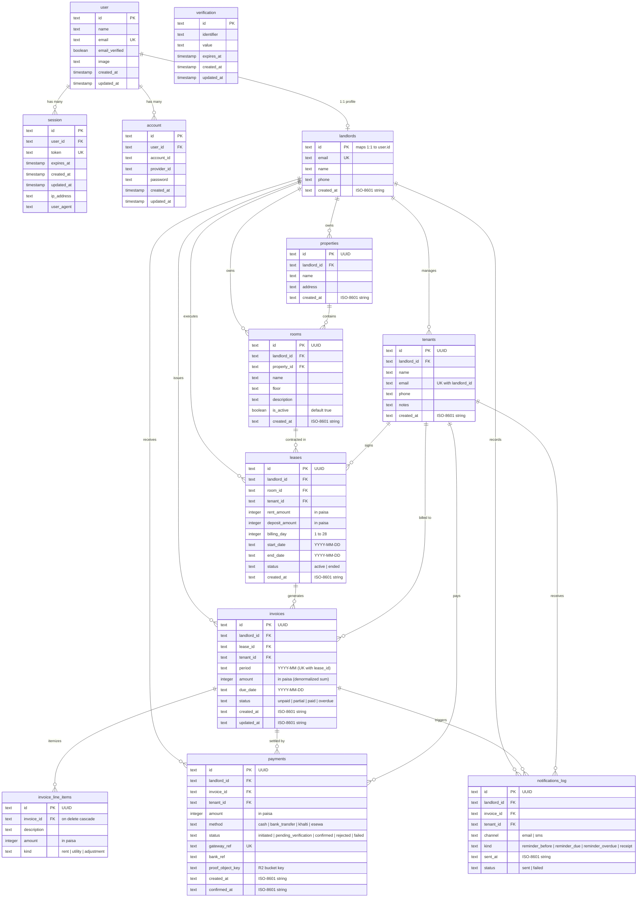

# Architecture & Domain Guide

This document provides a comprehensive technical overview of the architecture, data models, system boundaries, and core domain invariants of the **`ghar-bhandaa`** (घर भाडा) automated room rent collection and property management system.

---

## 1. System Overview & Technology Stack

`ghar-bhandaa` is designed specifically for landlords operating residential or commercial multi-room, multi-property rental agreements in Nepal. The application is built on modern full-stack web technologies and is deployed serverlessly to Cloudflare's edge infrastructure.

```
┌─────────────────────────────────────────────────────────────────────────────┐
│                              Application Stack                              │
├───────────────────────┬─────────────────────────────────────────────────────┤
│ Framework             │ TanStack Start v1 (Full-stack SSR with React 19)    │
├───────────────────────┼─────────────────────────────────────────────────────┤
│ Routing & State       │ TanStack Router (Type-safe file-based routing)       │
├───────────────────────┼─────────────────────────────────────────────────────┤
│ Edge Runtime          │ Cloudflare Workers (Global edge compute runtime)    │
├───────────────────────┼─────────────────────────────────────────────────────┤
│ Database              │ Cloudflare D1 (Serverless distributed SQLite)       │
├───────────────────────┼─────────────────────────────────────────────────────┤
│ Object-Relational     │ Drizzle ORM (`drizzle-orm/d1` dialect)              │
│ Mapping (ORM)         │ Drizzle Kit (`drizzle-kit` for schema migrations)   │
├───────────────────────┼─────────────────────────────────────────────────────┤
│ Authentication        │ Better Auth with Drizzle SQLite adapter & cookies   │
├───────────────────────┼─────────────────────────────────────────────────────┤
│ Storage               │ Cloudflare R2 (S3-compatible private object store)  │
├───────────────────────┼─────────────────────────────────────────────────────┤
│ Background Automation │ Cloudflare Cron Triggers (`0 1 * * *` UTC / 6:45 NPT)│
├───────────────────────┼─────────────────────────────────────────────────────┤
│ Validation            │ Zod (Runtime validation for forms & RPC calls)      │
├───────────────────────┼─────────────────────────────────────────────────────┤
│ Styling & UI          │ Tailwind CSS v4, Lucide React                       │
├───────────────────────┼─────────────────────────────────────────────────────┤
│ Testing & Tooling     │ Vitest, TypeScript 6, ESLint, Prettier, Wrangler    │
└───────────────────────┴─────────────────────────────────────────────────────┘
```

---

## 2. The Three-Entry-Point Architectural Model

All backend state modifications and domain business logic are decoupled from presentation routes and centralized in the framework-agnostic domain layer (`src/lib/`). The system exposes three distinct entry points that invoke this domain layer:



### 1. Server Functions RPC Layer (`src/server/*.functions.ts`)

- Implemented using TanStack Start's `createServerFn`.
- Serves as the primary type-safe communication channel between the React 19 UI and the serverless backend.
- Enforces function-level authorization via `landlordAuthMiddleware` and schema validation using Zod.

### 2. Scheduled Handlers (Cloudflare Cron Triggers)

- Configured in `wrangler.jsonc` to execute daily at `0 1 * * *` UTC (06:45 NPT in Kathmandu).
- Automatically iterates through active leases to generate monthly invoices idempotently and recalculates overdue invoice statuses.

### 3. Public Webhooks & API Endpoints (`src/routes/api/`)

- Public HTTP routes such as the Better Auth handler (`/api/auth/$`) and payment gateway callback webhooks (e.g. Khalti and eSewa).
- Validates cryptographic webhook signatures before invoking ledger updates in `src/lib/payments.server.ts`.

### 4. Pure Domain Logic Layer (`src/lib/*.server.ts`)

- Centralized, framework-independent business logic for invoice generation, status recalculation, payment recording, timezone math, and paisa arithmetic.
- Eliminates code duplication across entry points and guarantees transactional consistency.

---

## 3. End-to-End Request & Navigation Lifecycle



---

## 4. Entity Relationship Diagram (ERD)

The `ghar-bhandaa` database is structured into 13 tables partitioned into Better Auth identity management tables and rental domain tables. All domain tables enforce tenant isolation via `landlordId`.



---

## 5. Core Domain Invariants & Business Logic

The `ghar-bhandaa` domain engine enforces 10 strict architectural invariants:

### 1. Nepal / Kathmandu Timezone Handling (`Asia/Kathmandu`, UTC+05:45)

- Nepal standard time is offset by +05:45 (345 minutes) from UTC without Daylight Saving Time.
- Standard naive date arithmetic produces 1-day boundary drift when executed in edge workers or client browsers near UTC midnight.
- **Rule**: All calendar operations (due dates, billing days, month boundaries, and past-date checks) must use the timezone helpers in `src/lib/dates.ts`:
  - `getTodayInKathmandu()`: Returns current date as `YYYY-MM-DD` using `Intl.DateTimeFormat` with `timeZone: 'Asia/Kathmandu'`.
  - `addDaysInKathmandu(days, fromDateStr?)`: Adds days using the 345-minute offset.
  - `isPastDateInKathmandu(dateStr)`: Compares ISO date strings lexicographically against Kathmandu today.
  - `getCurrentDateTimeInKathmandu()`: Produces UTC ISO-8601 timestamps (`new Date().toISOString()`) for database `created_at` and `updated_at` columns.

### 2. Monetary Amounts & Integer Paisa Arithmetic

- Floating-point representations (e.g. IEEE 754 floats) are strictly prohibited for monetary storage and calculations to eliminate rounding inaccuracies.
- **Rule**:
  - $1\text{ NPR} = 100\text{ Paisa}$.
  - All database columns (`rent_amount`, `deposit_amount`, `invoices.amount`, `invoice_line_items.amount`, `payments.amount`) store integer minor units (paisa).
  - Schema validators enforce `.multipleOf(0.01)` on user NPR inputs.
  - Conversions use `nprToPaisa(npr)` (`Math.round(npr * 100)`) and `paisaToNpr(paisa)` (`paisa / 100`) from `src/lib/money.ts`.
  - Currency formatting uses `formatNpr(paisa)` via `Intl.NumberFormat('en-NP', { style: 'currency', currency: 'NPR' })`.

### 3. Append-Only Payment Ledger & Financial Integrity

- The `payments` table operates as an immutable financial ledger. Rows are never updated (except initial status transitions from pending to confirmed) and **never deleted**.
- Deleting an invoice or tenant with existing payment records is blocked by foreign key constraints.
- **Rule**: The server function `recordCashPayment` enforces that payment amounts must be strictly positive ($> 0$) and cannot exceed the remaining balance ($\le \text{invoice.amount} - \sum \text{confirmed payments}$). Cash overpayments are rejected.

### 4. Deterministic Invoice Status State Machine

- Invoices transition through a deterministic 4-state lifecycle (`unpaid`, `partial`, `overdue`, `paid`).
- Invoice statuses are never assigned manually; they are recomputed dynamically via `recalculateInvoiceStatus(db, invoiceId)`:

```
                            ┌────────────────┐
                            │    UNPAID      │
                            │ (0 paid, <=due)│
                            └───────┬────────┘
                                    │
               ┌────────────────────┼────────────────────┐
               │ Due Date Passes    │ Partial Payment    │ Full Payment
               │ (dueDate < today)  │ (0 < paid < total) │ (paid >= total)
               ▼                    ▼                    ▼
     ┌──────────────────┐  ┌──────────────────┐  ┌──────────────────┐
     │     OVERDUE      │  │     PARTIAL      │  │      PAID        │
     │  (unpaid/partial │  │ (0 < paid < total│  │ (paid >= total)  │
     │   & past due)    │  │   & <= due date) │  │                  │
     └──────────────────┘  └────────┬─────────┘  └──────────────────┘
               ▲                    │                     ▲
               │ Due Date Passes    └─────────────────────┤ Full Settle
               │ (dueDate < today)                        │ (paid >= total)
               └──────────────────────────────────────────┘
```

- **Precedence Hierarchy**:
  1. `paid`: $\sum \text{confirmed payments} \ge \text{invoice.amount}$
  2. `overdue`: $\sum \text{confirmed payments} < \text{invoice.amount} \land \text{invoice.dueDate} < \text{today}_{\text{Kathmandu}}$
  3. `partial`: $0 < \sum \text{confirmed payments} < \text{invoice.amount} \land \text{invoice.dueDate} \ge \text{today}_{\text{Kathmandu}}$
  4. `unpaid`: $\sum \text{confirmed payments} = 0 \land \text{invoice.dueDate} \ge \text{today}_{\text{Kathmandu}}$

### 5. Multi-Tenant Data Isolation & Landlord Authorization

- Every domain resource (`properties`, `rooms`, `tenants`, `leases`, `invoices`, `payments`, `notifications_log`) is explicitly scoped to a `landlordId`.
- **Function Middleware**: `landlordAuthMiddleware` intercepts all data-access server functions, validates the Better Auth session, confirms the user exists in `landlords`, and injects `landlordId`.
- **Relational Integrity**:
  - `createRoom` validates that the specified `propertyId` belongs to `context.landlordId`.
  - `createLease` validates that both `roomId` and `tenantId` belong to `context.landlordId`.
  - `recordCashPayment` and `createManualInvoice` validate invoice and lease ownership.
  - Multi-landlord tenant email support is achieved via a composite unique index `(landlord_id, email)` on the `tenants` table.

### 6. Idempotent Invoice Generation

- To prevent duplicate billing during automated cron execution or network retries, the `invoices` table enforces a composite unique constraint on `(lease_id, period)`.
- A lease cannot have more than one invoice for a given billing month (e.g. `2026-08`).

### 7. Transactional Integrity for Multi-Entity Mutations

- Multi-row operations (`createManualInvoice`, `recordCashPayment`, `registerLandlord`) are wrapped in `db.transaction(async (tx) => { ... })`.
- If any operation fails (such as line-item insertion or status recalculation), the entire operation rolls back cleanly.

### 8. Private R2 Proof Storage

- Tenant payment receipt screenshots are uploaded directly to a private Cloudflare R2 bucket (`ghar-bhandaa-proofs`).
- Proof objects are never exposed publicly and are streamed exclusively through authenticated landlord endpoints (`/api/proofs/$`).

### 9. Notification Deduplication

- Automated email and SMS reminders are tracked in `notifications_log` with a composite index on `(invoice_id, kind)`.
- The system checks `notifications_log` prior to dispatching reminders, ensuring tenants never receive duplicate notices for the same billing event.

### 10. Billing Day Range Limitation

- Monthly lease agreements restrict `billingDay` to integers between `1` and `28`.
- This ensures billing days exist across all 12 calendar months in both Gregorian (February) and Bikram Sambat calendars without overflow.

---

## 6. Frontend Routing & Layout Architecture

The user interface utilizes TanStack Router's file-based route tree:

```
src/routes/
├── __root.tsx                    # HTML document root, themes, public headers, devtools
├── index.tsx                     # Landing page redirecting to /dashboard or /login
├── login.tsx                     # Landlord login form (Better Auth)
├── signup.tsx                    # Landlord registration form
├── about.tsx                     # System information and architecture overview
├── api/
│   └── auth/
│       └── $.ts                  # Better Auth catch-all HTTP handler
└── _authed.tsx                   # Authenticated layout guard (beforeLoad check)
    ├── dashboard.tsx             # Financial KPIs, stats, and recent invoice table
    ├── properties.tsx            # Property registry and management
    ├── rooms.tsx                 # Room/unit registry with property filtering
    ├── tenants.tsx               # Tenant contact registry
    ├── leases.tsx                # Active & ended lease agreements
    └── invoices.
        └── $invoiceId.tsx        # Invoice detail view & cash payment recording
```

### Route Guards & Loader Pattern

- **Guard**: `src/routes/_authed.tsx` defines a `beforeLoad` hook that invokes `checkLandlordAuth()`. If the session is unauthenticated, the router throws `redirect({ to: '/login' })`.
- **Loaders**: Authenticated routes declare typed `loader` functions that call server functions (e.g. `getDashboardData()`, `getProperties()`, `getInvoiceDetails({ id })`).
- **Revalidation**: Form actions and mutations call `router.invalidate()` upon completion, triggering automatic, non-blocking refetches of active route loaders.
