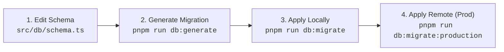

# Developer & Operations Guide

This guide provides step-by-step instructions for local development, database schema migrations, testing, Cloudflare deployment, and cron trigger operations for the **`ghar-bhandaa`** project.

---

## 1. Prerequisites & Environment Setup

### 1.1 Required Tools

- **Node.js**: `v22.0.0` or higher
- **pnpm**: `v10.0.0` or higher (`corepack enable pnpm`)
- **Cloudflare Wrangler CLI**: Installed as a dev dependency or globally (`npm i -g wrangler`)
- **Git**: For version control

### 1.2 Initial Installation

Clone the repository and install all dependencies:

```bash
git clone https://github.com/KosalRaj/ghar-bhandaa.git
cd ghar-bhandaa
pnpm install
```

### 1.3 Environment Variables Configuration

Create a local `.dev.vars` file in the root directory for Cloudflare Worker local development variables and secrets:

```ini
# .dev.vars
BETTER_AUTH_SECRET="super-secret-random-hex-string-at-least-32-chars"
APP_BASE_URL="http://localhost:3000"
```

To generate a secure secret for Better Auth:

```bash
pnpm dlx @better-auth/cli secret
```

---

## 2. Cloudflare D1 Database & Drizzle Migrations

The database is managed with [Drizzle ORM](https://orm.drizzle.team/) targeting Cloudflare D1 SQLite.

### 2.1 Database Configuration Files

- **Schema Definitions**: `src/db/schema.ts`
- **Drizzle Client Factory**: `src/db/index.ts`
- **Drizzle Kit Config**: `drizzle.config.ts`
- **Wrangler Bindings**: `wrangler.jsonc` (`d1_databases` with binding `DB`)

### 2.2 Schema Migration Workflow



#### Step 1: Modify Table Definitions

Update or add table definitions in `src/db/schema.ts`.

#### Step 2: Generate Migration SQL Files

Generate migration SQL files and update snapshot metadata in `drizzle/`:

```bash
pnpm run db:generate
```

_Behind the scenes_: Executes `drizzle-kit generate`, creating timestamped `.sql` files in `drizzle/` (e.g. `drizzle/0000_clear_punisher.sql`).

#### Step 3: Apply Migrations to Local D1 Database

Apply the generated migrations to the local Miniflare D1 database:

```bash
pnpm run db:migrate
```

_Behind the scenes_: Executes `wrangler d1 migrations apply ghar-bhandaa-db --local`.

#### Step 4: Apply Migrations to Production D1 Database

When deploying schema updates to live production:

```bash
pnpm run db:migrate:production
```

_Behind the scenes_: Executes `wrangler d1 migrations apply ghar-bhandaa-db --remote`.

---

## 3. Local Development

Start the development server with Hot Module Replacement (HMR) and Cloudflare Vite plugin emulation:

```bash
pnpm run dev
```

- The app will be available at **`http://localhost:3000`**.
- TanStack Devtools and TanStack Router Devtools are available on the bottom right of the UI.
- Local SQLite database states are stored inside `.wrangler/state/v3/d1`.

---

## 4. Testing & Code Quality Assurance

### 4.1 Running Vitest Test Suite

The repository includes comprehensive unit and invariant tests covering currency arithmetic, timezone offsets, invoice state transitions, and cash payment constraints.

```bash
# Run all tests once
pnpm test

# Run tests in watch mode
pnpm dlx vitest
```

#### Test Suite Structure:

- `src/lib/__tests__/dates.test.ts`: Tests Kathmandu timezone (+05:45) formatting, UTC midnight shifts, and leap year date arithmetic.
- `src/lib/__tests__/money.test.ts`: Tests integer paisa conversion, floating-point IEEE-754 precision mitigation, and NPR formatting.
- `src/lib/__tests__/invoices.server.test.ts`: Tests deterministic state transitions (`unpaid`, `partial`, `overdue`, `paid`) and manual invoice summation.
- `src/lib/__tests__/payments.server.test.ts`: Tests cash payment recording, ledger immutability, overpayment bounds, and landlord ownership checks.
- `src/lib/__tests__/stress.test.ts`: Fuzz testing and stress validation for high-frequency calculations.

### 4.2 Static Analysis & Formatting

Run all checks before submitting pull requests:

```bash
# 1. Typecheck the entire project with TypeScript
pnpm run typecheck

# 2. Lint code with ESLint
pnpm run lint

# 3. Check Prettier code style
pnpm run check

# 4. Automatically fix lint and formatting errors
pnpm run format
```

---

## 5. Cloudflare Workers Deployment

The project is compiled with Vite using `@cloudflare/vite-plugin` and deployed serverlessly to Cloudflare Workers.

### 5.1 Cloudflare Resources Configuration (`wrangler.jsonc`)

```jsonc
{
  "$schema": "node_modules/wrangler/config-schema.json",
  "name": "ghar-bhandaa",
  "compatibility_date": "2025-09-02",
  "compatibility_flags": ["nodejs_compat"],
  "main": "@tanstack/react-start/server-entry",
  "d1_databases": [
    {
      "binding": "DB",
      "database_name": "ghar-bhandaa-db",
      "database_id": "<YOUR_D1_DATABASE_ID>",
      "migrations_dir": "drizzle",
    },
  ],
  "r2_buckets": [
    {
      "binding": "PROOFS",
      "bucket_name": "ghar-bhandaa-proofs",
      "preview_bucket_name": "ghar-bhandaa-proofs-preview",
    },
  ],
  "triggers": {
    "crons": ["0 1 * * *"],
  },
  "vars": {
    "APP_BASE_URL": "https://ghar-bhandaa.yourdomain.workers.dev",
  },
}
```

### 5.2 Initial Cloudflare Setup

1. **Log in to Cloudflare**:
   ```bash
   npx wrangler login
   ```
2. **Create Remote D1 Database**:
   ```bash
   npx wrangler d1 create ghar-bhandaa-db
   ```
   Copy the output `database_id` into `wrangler.jsonc`.
3. **Create Remote R2 Storage Bucket**:
   ```bash
   npx wrangler r2 bucket create ghar-bhandaa-proofs
   ```
4. **Set Production Secrets**:
   ```bash
   npx wrangler secret put BETTER_AUTH_SECRET
   ```

### 5.3 Building & Deploying

Build production client and SSR bundles and deploy to Cloudflare Workers:

```bash
pnpm run deploy
```

_Behind the scenes_: Executes `pnpm run build && wrangler deploy`.

---

## 6. Scheduled Cron Triggers (Automated Invoicing & Reminders)

### 6.1 Schedule Specification

The system triggers automated maintenance daily:

- **Expression**: `0 1 * * *` (UTC 01:00)
- **Kathmandu Local Time**: **06:45 NPT (Asia/Kathmandu)**

### 6.2 Execution Tasks

On each cron trigger execution, the worker:

1. Iterates over all active leases where `leases.billingDay === currentDayInKathmandu`.
2. Generates the monthly invoice for `currentPeriod` (e.g. `2026-08`) if one does not already exist (idempotency backed by unique index `(lease_id, period)`).
3. Batches status updates for all unpaid invoices where `dueDate < todayInKathmandu`, setting status to `'overdue'`.
4. Queues pending reminder notices in `notifications_log`.

### 6.3 Local Simulation of Cron Triggers

To test scheduled triggers locally with Wrangler:

```bash
# Start worker with test scheduled flag
npx wrangler dev --test-scheduled

# In another terminal, trigger the cron event:
curl "http://localhost:8787/__scheduled?cron=0+1+*+*+*"
```

---

## 7. Developer Gotchas & Invariant Rules

| Topic              | Gotcha                                                                       | Correct Pattern                                                                                           |
| ------------------ | ---------------------------------------------------------------------------- | --------------------------------------------------------------------------------------------------------- |
| **Currency**       | Using JavaScript floating-point numbers (`12000.50`) for calculations in DB. | Store only integer Paisa (`1200050`). Use `nprToPaisa()` and `paisaToNpr()`.                              |
| **Timezone**       | Using client browser `new Date()` or `Date.now()` directly for due dates.    | Use `getTodayInKathmandu()` and `addDaysInKathmandu()` from `src/lib/dates.ts`.                           |
| **Multi-Tenancy**  | Trusting foreign keys in incoming payloads (e.g. `propertyId`, `tenantId`).  | Always query ownership `where: and(eq(id, payloadId), eq(landlordId, context.landlordId))` before insert. |
| **Overpayments**   | Recording cash payments without checking invoice balance.                    | Query current confirmed payments and verify `paymentAmountPaisa <= remainingPaisa`.                       |
| **Invoice Status** | Manually writing `invoices.status = 'paid'`.                                 | Always invoke `recalculateInvoiceStatus(tx, invoiceId)` to evaluate status deterministically.             |
